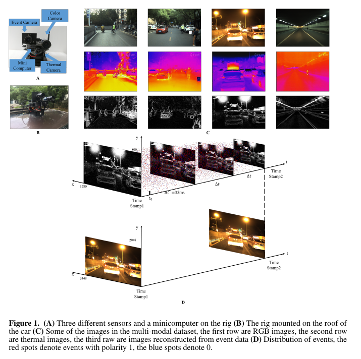
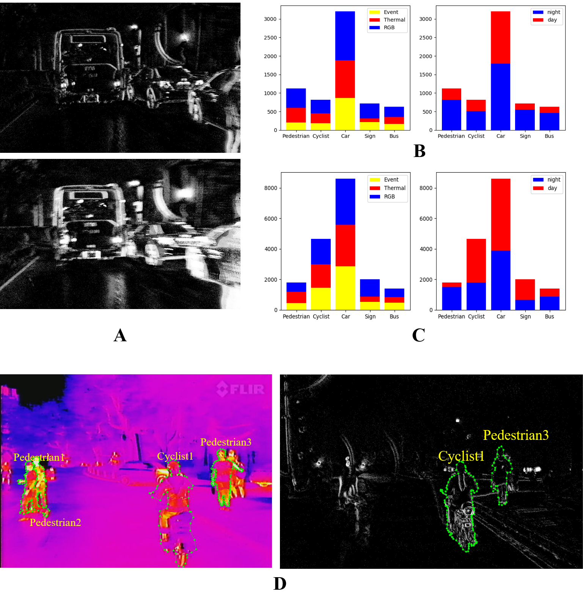

# ERTD: An Event-RGB-Thermal Dataset for Object Detection and Instance Segmentation
Yan Zhang, Shijie Lin, Hao Li, Jialin Zhao, Yuqian Fu, Bingde Liu, Wen Yang and Lei Yu
## Equipment and Some Examples of The Dataset

- A.Three different sensors and a minicomputer on the rig 
- B.The rig mounted on the roof of the car 
- C.Some of the images in the multi-modal dataset, the first row are RGB images, the second row are thermal images, the third raw are images reconstructed from event data 
- D.Distribution of events, the red spots denote events with polarity 1, the blue spots denote 0.

## Attribution of our dataset

- A.The time span of first row is 35ms, the secoTo help readers better use these data, we an additional tag ``id'' for each object, and the same object in images of three modalities has the same idnd row is 111 ms 
- B.The distribution of objects in the object detection dataset 
- C.The distribution of instances in the instance segmentation dataset 
- D.Labeled images in the instance segmentation dataset

## Download
We have uploaded annotated images, labels and raw event data to cloud sever, users can download data by clicking the following Mega sharing links.

data | File Size |Cloud Disk Link
------------ | -------------| -------------
Multi-modal dataset for object detection | 3.33  GB |[Mega share link](https://mega.nz/#F!pwclxSIY!A4RM_dHoQL4V_jBT0TvZBQ)
Multi-modal dataset for instance segmentation | 550.7  MB |[Mega share link](https://mega.nz/#!Mo1zSQhB!6goY8dhxHGLsK73WLLso5YvztM4QBeInag9V4DblWOs)
Raw event data at daytime | 11.21 GB |[Mega share link](https://mega.nz/#!QN0jWASD!c70PnQAlnVwUCJNCYyaU7WA1YFBgJPvuZr8_2EOvdrg)
Raw event data at nighttime | 9.43  GB |[Mega share link](https://mega.nz/#!8ktzhSRT!IsfInLvgZJBh9y3CYY6LPUCr73ScE9fnM1lGqpz1eU8)
Timestamps| 551 KB|[Mega share link](https://mega.nz/#!Z591CK6Z!Uyumhg5gaPMYFjDazbCeLEQLeUAi-RM9Y5wgGGYGN40)
## About the data
1.To help readers better use these data, we an additional tag ``id'' for each object, and the same object in images of three modalities has the same id.

2.We use the label tool Labelme to annotate instance segmentation dataset, then we transfer labels we get to the format that used in COCO dataset.

3.The file ``Timestamps'' record that each event image reconstructed from which event data as well as the timestamps of rgb images and thermal images.
